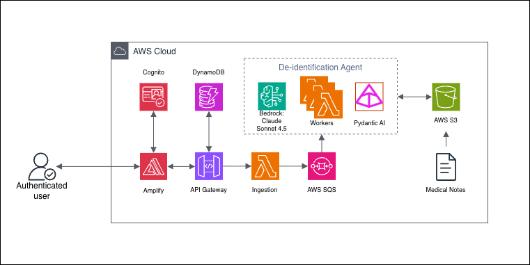

# PII De-identification Platform

| Index                         | Description                                                   |
|:------------------------------|:--------------------------------------------------------------|
| [Overview](#overview)         | See what this project does and its key capabilities           |
| [Demo](#demo)                 | View the demo experience and walkthrough video                |
| [Description](#description)   | Learn about the problem and our approach                      |
| [Architecture](#architecture) | View the system architecture diagram                          |
| [Tech Stack](#tech-stack)     | Technologies and services used                                |
| [Deployment](#deployment)     | How to install and deploy the solution                        |
| [Usage](#usage)               | How to process notes and approve redactions                   |
| [Costs](#costs)               | Cost drivers and estimation guidance                          |
| [Credits](#credits)           | Project ownership and contributors                            |
| [License](#license)           | Current license status for this repository                    |
| [Disclaimers](#disclaimers)   | Important legal and operational disclaimers                   |

# Overview

PII De-identification Platform is an AI-driven system for detecting and redacting sensitive information in clinical and
operational text documents. The solution uses large language models (LLMs) through AWS services to identify PHI/PII
with context awareness, generate redacted outputs, and support human review before release.

This project was created in response to a request by a research team at the University of Pittsburgh and the longstanding need for an effective and efficient de-identification system. Prior solutions for redaction were slow, inconsistent, and difficult to scale across large note volumes. The team that approached us relied on a static list of known PII, which often failed to catch context-specific or unique information, and a system that took an entire week to process, often failing halfway through. 

The platform provides end-to-end capabilities including batch ingestion, asynchronous processing, LLM-based detection,
redacted artifact generation, reviewer approval workflows, and operational metrics for monitoring system health.

Key capabilities include:

- **Automated PII Detection**: Uses Claude via Amazon Bedrock to identify sensitive entities in clinical or operational notes.
- **Redacted Output Generation**: Produces redacted text and entity metadata for each input note.
- **Human-in-the-Loop Review**: Provides a dashboard to compare original vs redacted text, edit, and approve.
- **Batch Processing at Scale**: Uses S3, SQS, and Lambda for asynchronous, serverless processing.
- **Operational Visibility**: Tracks batch stats and emits CloudWatch metrics for throughput, latency, retries, and failures.

# Demo

https://github.com/user-attachments/assets/1f35119a-5b6a-4158-8f5e-0d6de21e8fe0

Info site: [info-site](info-site)

# Description

## Problem Statement

Medical research teams handling protected health information (PHI) and personally identifiable information (PII) must de-identify notes before secondary use, collaboration, and analytics. Existing solutions struggle with context-specific identifiers, produce inconsistent results, and require long runtimes. A context-aware automated pipeline with human-in-the-loop validation was needed.

## Our Approach

PII De-identification Platform addresses these challenges through a context-aware, serverless redaction pipeline that combines LLM-based entity detection, asynchronous processing, and structured human review.

**Asynchronous Ingestion Pipeline**: Notes are uploaded in batch folders to Amazon S3 and queued through Amazon SQS for processing. This design allows the system to handle high note volumes without blocking user workflows and supports reliable retries for long-running jobs.

**AI Detection and Redaction Layer**: Worker Lambda functions call Claude Sonnet 4.5 via Amazon Bedrock to identify PII in context, then generate redacted outputs and entity artifacts per note. This improves detection quality beyond
static pattern matching and supports all 18 HIPAA identifier categories.

**Secure Access**: The platform uses Cognito for authentication and access control across the dashboard and API workflows. This ensures only authorized users can sign in, process batches, and approve redacted
outputs.

**Human-in-the-Loop Review Workflow**: The review interface lets users inspect original vs. redacted text, edit redactions, and approve notes or full batches. Approved outputs are tracked separately, supporting controlled release workflows and reviewer quality oversight.

# Architecture



# Tech Stack

| Category                      | Technology                                                | Purpose                                                |
|:------------------------------|:----------------------------------------------------------|:-------------------------------------------------------|
| **Amazon Web Services (AWS)** | [AWS CDK](https://docs.aws.amazon.com/cdk/)               | Infrastructure as code                                 |
|                               | [Amazon Bedrock](https://aws.amazon.com/bedrock/)         | Claude-based PII detection                             |
|                               | [AWS Lambda](https://aws.amazon.com/lambda/)              | Ingestion, processing, and API compute                 |
|                               | [Amazon S3](https://aws.amazon.com/s3/)                   | Input/output note storage                              |
|                               | [Amazon SQS](https://aws.amazon.com/sqs/)                 | Asynchronous note processing queue                     |
|                               | [Amazon API Gateway](https://aws.amazon.com/api-gateway/) | Authenticated REST API                                 |
|                               | [Amazon Cognito](https://aws.amazon.com/cognito/)         | Authentication and user management                     |
|                               | [Amazon DynamoDB](https://aws.amazon.com/dynamodb/)       | Batch statistics/state                                 |
|                               | [AWS Amplify](https://aws.amazon.com/amplify/)            | Frontend hosting                                       |
|                               | [Amazon CloudWatch](https://aws.amazon.com/cloudwatch/)   | Metrics and operational dashboard                      |
| **Backend**                   | [Python 3.12](https://www.python.org/)                    | Lambda runtime                                         |
|                               | [pydantic-ai](https://ai.pydantic.dev/)                   | Agent orchestration around Bedrock                     |
|                               | [boto3](https://aws.amazon.com/sdk-for-python/)           | AWS SDK                                                |
|                               | [aws-lambda-powertools](https://awslabs.github.io/aws-lambda-powertools-python/latest/) | Logging, metrics, and partial batch handling |
| **Frontend**                  | [React](https://react.dev/)                               | Review dashboard UI                                    |
|                               | [Vite](https://vite.dev/)                                 | Frontend build and dev server                          |
|                               | [TypeScript](https://www.typescriptlang.org/)             | Type-safe frontend development                         |
|                               | [TanStack Query](https://tanstack.com/query/latest)       | API data synchronization and caching                   |
|                               | [AWS Amplify SDK](https://docs.amplify.aws/)              | Cognito authentication integration                     |

# Deployment

## Prerequisites

Prepare the following tools and accounts before deploying:

1. An active [AWS account](https://signin.aws.amazon.com/signup?request_type=register)
2. **Node.js** (18+) from the [official download page](https://nodejs.org/en/download), or install it with
   [nvm](https://github.com/nvm-sh/nvm)
3. **AWS CDK v2**, installed globally:
   ```bash
   npm install -g aws-cdk
   ```
4. **AWS CLI** using this [installation guide](https://docs.aws.amazon.com/cli/latest/userguide/getting-started-install.html)
5. **Docker** from [docker.com/get-started](https://www.docker.com/get-started/)
6. **Git** from [git-scm.com](https://git-scm.com/)

## AWS Configuration

1. **Configure AWS CLI with your credentials**:

   ```bash
   aws configure
   ```

   Provide your AWS Access Key ID, Secret Access Key, and default region (for example, `us-east-1`) when prompted.

2. **Bootstrap CDK for your target account/region** _(required once per account/region)_:

   ```bash
   cdk bootstrap aws://ACCOUNT_ID/REGION
   ```

   Replace `ACCOUNT_ID` and `REGION` with the AWS account and region where you are deploying.

## Quick Start (Recommended)

1. **Clone the repository**:

   ```bash
   git clone git@github.com:pitt-cic/pii-deidentification-project.git
   cd pii-deidentification-project
   ```

2. **Deploy infrastructure with CDK**:

   ```bash
   cd cdk
   npm install
   npm run deploy
   ```

3. **Retrieve stack outputs** (API URL, Cognito IDs, bucket name, region, dashboard URL):

   ```bash
   aws cloudformation describe-stacks \
     --stack-name PiiDeidentificationStack \
     --query "Stacks[0].Outputs[].[OutputKey,OutputValue]" \
     --output table
   ```

4. **Use Amplify deployment for the frontend**:

   The deployed stack provides `AmplifyAppUrl` for the hosted application. Frontend updates are continuously deployed
   through Amplify from your main branch.

### Local Frontend Setup

1. **Install dependencies**:
   ```bash
   cd ../frontend
   npm install
   ```

2. **Add environment variables** to `frontend/.env`:
   ```bash
   VITE_API_URL=<ApiUrl>
   VITE_USER_POOL_ID=<UserPoolId>
   VITE_USER_POOL_CLIENT_ID=<UserPoolClientId>
   VITE_AWS_REGION=<AwsRegion>
   VITE_UPLOAD_BUCKET=<BucketName>
   ```

3. **Start development server**:
   ```bash
   npm run dev
   ```

## Local Testing

In addition to the deployed app flow, this repository has local evaluation tooling and a synthetic data generation pipeline for offline testing and evaluation with ground truth data.

### Evaluation Dashboard

If you want to test locally with the dashboard backend entrypoint, use `dashboard/backend/main.py`:

```bash
cd dashboard/backend
pip install -r requirements.txt
uvicorn main:app --reload --port 8000
```

In a second terminal, run the dashboard frontend:

```bash
cd dashboard/frontend
npm install
npm run dev
```

This dashboard reads local evaluation artifacts from `eval_results/`, `synthetic_dataset/`, `output-json/`, and
`output-text/`.

### Synthetic Data Generator

Use the generator and evaluator scripts under `backend/synthetic-data-generator` for local dataset creation and scoring:

```bash
cd backend/synthetic-data-generator
python scripts/generate_bulk.py --help
python scripts/evaluate.py --help
```

Example evaluation command against repo-level datasets:

```bash
cd backend/synthetic-data-generator
python scripts/evaluate.py \
  --ground-truth ../../synthetic_dataset/manifests \
  --solution ../../output-json
```

# Usage

1. **Open the application**:

   - Primary path: use `AmplifyAppUrl` from stack outputs
   - Local: use the URL printed by `npm run dev`

2. **Create a Cognito user** (admin action):

   ```bash
   aws cognito-idp admin-create-user \
     --user-pool-id <UserPoolId> \
     --username "user@example.com" \
     --user-attributes \
       Name=email,Value=user@example.com \
       Name=given_name,Value=First \
       Name=family_name,Value=Last \
     --desired-delivery-mediums EMAIL
   ```

   Replace `<UserPoolId>` with the output from your deployed stack.

3. **Sign in**:

   Log in with the invited user and temporary password, then set a permanent password on first login.

4. **Create a batch and upload `.txt` notes**:

   ```bash
   ./scripts/create_batch.sh --notes-dir /PATH/TO/NOTES
   ```

   To upload to an existing batch:

   ```bash
   ./scripts/create_batch.sh --batch-id "<batch-id>" --notes-dir /PATH/TO/NOTES
   ```

   If needed, pass additional options:
   - `--stack-name <name>` when stack name differs from `PiiDeidentificationStack`
   - `--profile <profile>` and `--region <region>` for non-default AWS CLI contexts
   - `--bucket <bucket-name>` to bypass stack output lookup

   <details>
   <summary><strong>Manual CLI Method (No Helper Script)</strong></summary>

   ```bash
   BUCKET=$(aws cloudformation describe-stacks \
     --stack-name PiiDeidentificationStack \
     --query "Stacks[0].Outputs[?OutputKey=='BucketName'].OutputValue | [0]" \
     --output text)

   BATCH_ID="batch-$(date -u +%Y%m%d%H%M%S)"

   aws s3api put-object --bucket "$BUCKET" --key "$BATCH_ID/input/"
   aws s3 cp /PATH/TO/NOTES "s3://$BUCKET/$BATCH_ID/input/" \
     --recursive --exclude "*" --include "*.txt"
   ```

   </details>

5. **Start de-identification**:

   Select the batch in the dashboard and click **Start De-identification**.

6. **Review and approve outputs**:

   Open the review page, compare original vs redacted text, edit if needed, and approve note-by-note or use
   **Approve All** after processing completes.

7. **Monitor processing health**:

   - Dashboard shows batch/note status (`Created`, `Processing`, `Needs Review`, `Approved`)
   - CloudWatch dashboard (from `DashboardUrl` output) shows latency, retries, failures, and throughput

# Costs

The following costs are estimated based on AWS pricing as of Feburary 2026, and assuming each medical note is around 1000 tokens. Actual costs will vary based on AWS region, note volume, note length, and model usage.

## Estimated Monthly Recurring Costs

| Service            | Estimated Cost | Notes                                                     |
|:-------------------|:-----------------------------|:----------------------------------------------------------|
| AWS Amplify        | ~$0     | Free tier covers most small deployments            |
| Amazon Cognito     | ~$0     | Free tier covers first 10,000 MAUs                           |
| Amazon S3          | <$1          | $0.023/GB a month                   |
| Amazon SQS         | ~$0         | First 1 million requests free                                      |
| AWS Lambda         | <$1     | Ingestion/worker/API invocations and duration             |
| API Gateway        | <$1       | Based on request volume                   |
| Amazon DynamoDB    | <$1    | Minimal to track read/write activity                           |
| Amazon CloudWatch  | ~$0  | Free tier includes logging and metrics                        |
| **Total Baseline** | **$0-$5/month** | Excludes variable Bedrock inference spend               |

## Per-Run / Per-Query Model Costs (Amazon Bedrock)

Each processing run incurs Bedrock charges based on token usage.

| Model                      | Estimated Usage (Placeholder) | Estimated Cost (Placeholder) |
|:---------------------------|:-------------------------------|:-----------------------------|
| Claude Sonnet 4.5 (input)  | `<INPUT_TOKENS_PER_RUN>`       | `<INPUT_COST_PER_RUN>`       |
| Claude Sonnet 4.5 (output) | `<OUTPUT_TOKENS_PER_RUN>`      | `<OUTPUT_COST_PER_RUN>`      |
| **Total per run**          | `<TOTAL_TOKENS_PER_RUN>`       | **`<TOTAL_COST_PER_RUN>`**   |

Example monthly variable model spend:

- `<RUNS_PER_MONTH_A>` runs/month: `<MONTHLY_BEDROCK_COST_A>`
- `<RUNS_PER_MONTH_B>` runs/month: `<MONTHLY_BEDROCK_COST_B>`
- `<RUNS_PER_MONTH_C>` runs/month: `<MONTHLY_BEDROCK_COST_C>`

# Credits

**PII De-identification Platform** is an open-source project developed by the University of Pittsburgh Health Sciences and Sports Analytics Cloud Innovation Center.

**Development Team:**

- [Mohammed Misran](https://www.linkedin.com/in/mmisran/)
- [Ava Luu](https://www.linkedin.com/in/avaluu/)

**Project Leadership:**

- **Technical Lead**: [Maciej Zukowski](https://www.linkedin.com/in/maciejzukowski/) - Solutions Architect, Amazon Web
  Services (AWS)
- **Program Manager**: [Kate Ulreich](https://www.linkedin.com/in/kate-ulreich-0a8902134/) - Program Leader, University
  of Pittsburgh Health Sciences and Sports Analytics Cloud Innovation Center

**Special Thanks:**

- [Dr. Gilles Clermont](https://www.linkedin.com/in/gilles-clermont/) - Professor of Critical Care Medicine, Mathematics and Engineering at Pitt

This project is designed and developed with guidance and support from
the [Health Sciences and Sports Analytics Cloud Innovation Center, powered by AWS](https://digital.pitt.edu/cic).

# License

This project is licensed under the [MIT License](./LICENSE).

```plaintext
MIT License

Copyright (c) 2026 University of Pittsburgh Health Sciences and Sports Analytics Cloud Innovation Center

Permission is hereby granted, free of charge, to any person obtaining a copy
of this software and associated documentation files (the "Software"), to deal
in the Software without restriction, including without limitation the rights
to use, copy, modify, merge, publish, distribute, sublicense, and/or sell
copies of the Software, and to permit persons to whom the Software is
furnished to do so, subject to the following conditions:

The above copyright notice and this permission notice shall be included in all
copies or substantial portions of the Software.

THE SOFTWARE IS PROVIDED "AS IS", WITHOUT WARRANTY OF ANY KIND, EXPRESS OR
IMPLIED, INCLUDING BUT NOT LIMITED TO THE WARRANTIES OF MERCHANTABILITY,
FITNESS FOR A PARTICULAR PURPOSE AND NONINFRINGEMENT. IN NO EVENT SHALL THE
AUTHORS OR COPYRIGHT HOLDERS BE LIABLE FOR ANY CLAIM, DAMAGES OR OTHER
LIABILITY, WHETHER IN AN ACTION OF CONTRACT, TORT OR OTHERWISE, ARISING FROM,
OUT OF OR IN CONNECTION WITH THE SOFTWARE OR THE USE OR OTHER DEALINGS IN THE
SOFTWARE.
```


For questions, issues, or contributions, please visit
our [GitHub repository](https://github.com/pitt-cic/) (placeholder: for now) or contact the development team.


## Disclaimers

**Customers are responsible for making their own independent assessment of the information in this document.**

**This document:**

(a) is for informational purposes only,

(b) references AWS product offerings and practices, which are subject to change without notice,

(c) does not create any commitments or assurances from AWS and its affiliates, suppliers or licensors. AWS products or
services are provided "as is" without warranties, representations, or conditions of any kind, whether express or
implied. The responsibilities and liabilities of AWS to its customers are controlled by AWS agreements, and this
document is not part of, nor does it modify, any agreement between AWS and its customers, and

(d) is not to be considered a recommendation or viewpoint of AWS.

**Additionally, you are solely responsible for testing, security and optimizing all code and assets on GitHub repo, and
all such code and assets should be considered:**

(a) as-is and without warranties or representations of any kind,

(b) not suitable for production environments, or on production or other critical data, and

(c) to include shortcuts in order to support rapid prototyping such as, but not limited to, relaxed authentication and
authorization and a lack of strict adherence to security best practices.

**All work produced is open source. More information can be found in the GitHub repo.**
